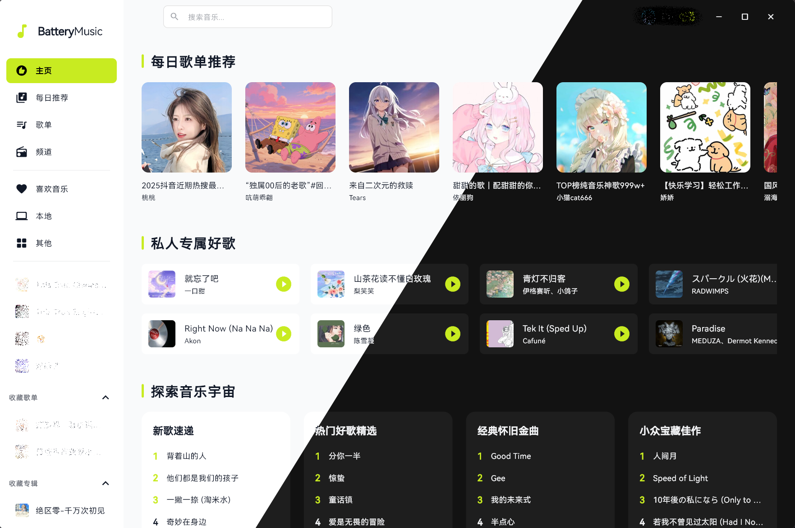

# 🎵 Battery Music

一款使用 Flutter 构建的、界面优雅的跨平台音乐播放器。随时随地享受你喜爱的音乐！

---

<div align="center">
  
</div>

---

## ✨ 功能特性

-   🎶 **无缝音乐体验**: 聆听海量音乐库。
-   🖥️ **跨平台支持**: 在 Windows、macOS 和 Linux 上流畅运行。
-   🎨 **现代化界面**: 干净、美观的界面，带来愉悦的体验。
-   🔍 **强大搜索**: 快速查找歌曲、歌手和歌单。
-   ❤️ **我的音乐我做主**: 创建和管理你自己的专属歌单。

## 💻 支持的平台

| 平台 | 支持状态 |
| :--- | :---: |
| ✅ Windows | ✔️ |
| ✅ Linux | ✔️ |
| ✅ macOS | ✔️  (未经测试) |
| 📱 Android | 🚧 (暂未适配) |
| 📱 iOS | 🚧 (暂未适配) |

## 🚀 快速上手

### 环境要求

-   **Flutter SDK**: `^3.41.1`

### 安装与运行

1.  **克隆仓库:**
    ```bash
    git clone https://github.com/Sen0E/Battery-Music.git
    cd Battery-Music
    ```

2.  **安装 Flutter 依赖:**
    ```bash
    flutter pub get
    ```
3.  **运行应用:**
    ```bash
    flutter run
    ```

---

## ⚠️ 免责声明

1. 本程序是一个酷狗音乐的第三方客户端，并非酷狗音乐官方产品，如需更完善的功能请下载官方客户端使用。
2. 本项目仅供学习交流使用，请尊重版权，禁止利用此项目从事商业行为及其他非法用途！
3. 使用本项目的过程中可能会生成版权相关的数据。对于这些数据，本项目不拥有其所有权。为避免侵权风险，使用者务必在24小时内删除使用本项目期间所产生的版权数据。
4. 使用本项目可能产生各种性质的直接、间接、特殊、偶然或后果性损失（包括但不限于利润损失、业务中断、计算机故障等），此类风险由使用者自行承担。
5. 严禁在违反国家或地区法律法规的前提下使用本项目。对于使用者在明知或未知当地法律法规禁止的情况下使用本项目所导致的任何违法违规行为，均由使用者承担责任，本项目概不负责。
6. 音乐平台发展不易，请尊重版权，支持正版。
7. 本项目仅用于技术可行性研究与探索，不接受任何形式的商业合作（包括但不限于广告等）及捐赠。
8. 如权利方认为本项目存在不妥之处，可联系本项目进行修改或移除。

---

## 🤝 贡献

欢迎各种贡献！如果你有关于新功能或 Bug 修复的想法，请随时创建 Issue 或提交 Pull Request。

## 📄 开源许可

本项目基于 AGPL-3.0 许可证 - 详情请见 [LICENSE](LICENSE) 文件。

## 🙏 致谢

-   [KuGouMusicApi](https://github.com/MakcRe/KuGouMusicApi/)